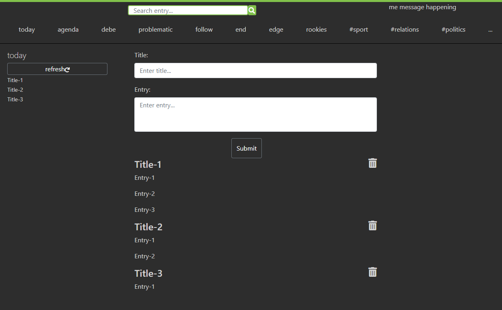

# Multiple Action Application JS

## JavaScript Challenging

## Explanation

We have an author - entry system in here. Authors can create entries with a title. When author wants to post an entry, title will be displayed on the left side area that contains list of entry titles. 
If author wants to post an entry with the same title, it'll be posted as comment entry under the same title.

Screenshot:

